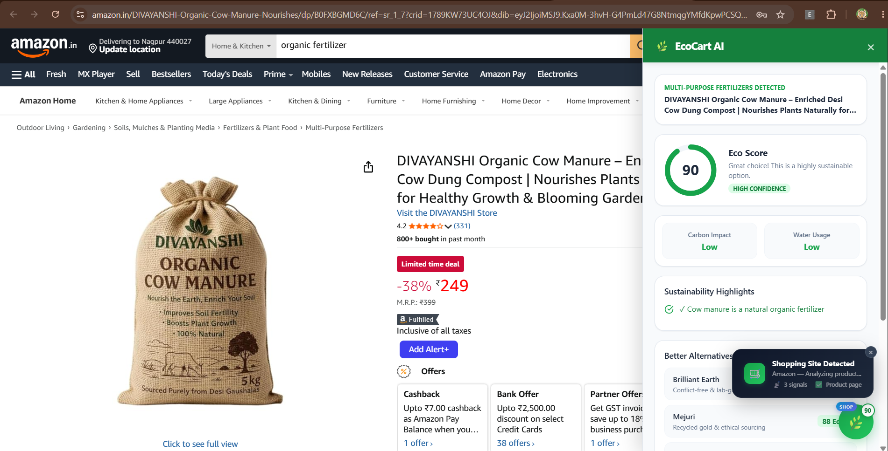
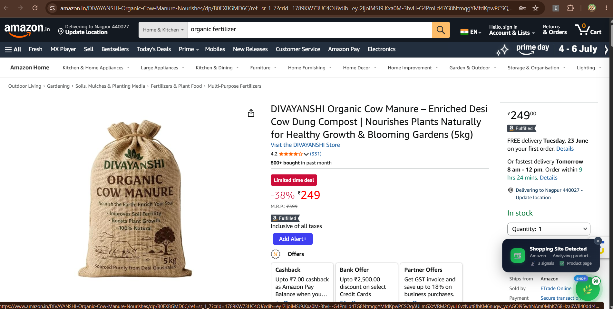
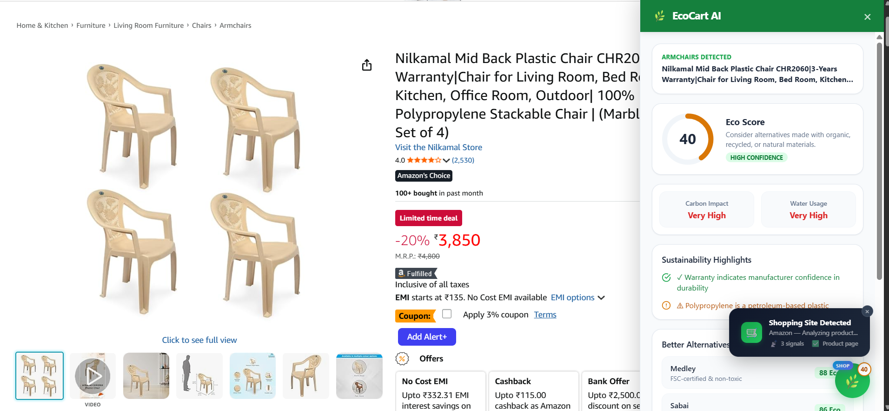

<p align="center">
  
</p>

# 🌿 EcoCart AI

**EcoCart AI** is a Chrome Extension that calculates the environmental footprint of products while you shop online, helping you make greener choices. Built for the PromptWars Hackathon, it runs **totally locally** with a robust, deterministic rule engine to deliver reliable sustainability scoring. It also features an **optional Gemini AI integration**—if you provide an API key, it unlocks deeper, natural language insights.

---

## 🎯 What it Does

EcoCart AI seamlessly integrates into your online shopping experience. When you visit **any supported shopping website**, the extension **automatically detects** the e-commerce site, opens a sleek sidebar panel, and shows real-time sustainability stats. On product pages, it extracts product details (materials, description, title) and provides an **Eco Score (0-100)**, estimating carbon impact and water usage.

It highlights the strengths and concerns of a product's manufacturing footprint and suggests greener alternatives.

---

## 📸 Screenshots

<p align="center">
  
  &nbsp;
  
  &nbsp;
  
</p>

---

## 🏗️ Architecture & AI Workflow

EcoCart uses a **Hybrid Architecture** prioritizing speed, reliability, and explainability.

1. **Shopping Site Detection**: A multi-signal detection engine identifies e-commerce websites using domain matching (50+ stores), platform fingerprinting (Shopify, WooCommerce, Magento), DOM analysis (cart links, add-to-cart buttons), and structured data (JSON-LD Product schemas, price metadata).
2. **Extraction**: A content script scrapes the product page for relevant metadata (title, materials, description) with site-specific extractors for Amazon, Flipkart, and a powerful generic extractor for all other sites.
3. **Local Rule Engine (Layer 1)**: The core Eco Score, Carbon Impact, and Water Usage are calculated using a deterministic local rule engine. This ensures the extension is blazing fast, perfectly testable, and highly explainable (e.g., Organic Cotton = +20 Score, -200L Water).
4. **Optional Gemini AI Integration (Layer 2)**: If you choose to add your API key, Gemini unlocks natural language explanations and dynamic recommendations based on the core score.
5. **Local-First by Design**: The extension requires no internet calls to our servers. It is perfectly functional and blazing fast out-of-the-box as a totally local extension, ensuring your privacy and reliability.

---

## ✨ Features

### Core Features
- **🛒 Auto-Detect Shopping Sites**: Automatically detects when you're on a shopping website and opens the sidebar with stats — no manual action needed.
- **📊 Instant Eco Score**: See how sustainable a product is at a glance (0-100 score with color-coded ring).
- **🌍 Impact Dashboard**: Understand estimated CO₂ emissions and Water Usage with visual breakdowns.
- **🧵 Material Analysis**: Get instant feedback on materials like Organic Cotton, Recycled Plastics, Polyester, etc.
- **🔄 Smart Fallbacks**: Completely functional without an API key thanks to our built-in rule engine.
- **🏆 Streak & Impact Tracking**: Track your total carbon saved, products analyzed, and green choices over time.
- **♿ Fully Accessible UI**: Built with a screen-reader friendly interface (`aria-labels`, semantic roles).

### Shopping Site Detection
- **Domain Recognition**: Recognizes 50+ major e-commerce domains worldwide.
- **Platform Fingerprinting**: Detects Shopify, WooCommerce, and Magento stores — even on unknown domains.
- **Smart DOM Analysis**: Finds cart/checkout links and "Add to Cart" buttons to identify any online store.
- **Structured Data Detection**: Reads JSON-LD Product schemas and OpenGraph/microdata price metadata.
- **Animated Toast Notification**: Shows a sleek dark-glass notification with the detected site name, signal count, and page type.
- **Pulsing Launcher**: The 🌿 FAB gets a green pulse animation and a "SHOP" badge when shopping is detected.
- **Session Memory**: If you dismiss the sidebar, it respects your preference and won't re-open on the same tab session.

### Sidebar Panel
- **Product Info Card**: Shows detected product title and category.
- **Eco Score Ring**: Animated circular progress ring with color coding (green/amber/red).
- **Carbon & Water Impact**: Side-by-side impact badges with severity coloring.
- **Sustainability Highlights**: Strengths and concerns listed with visual indicators.
- **Better Alternatives**: Category-aware suggestions for greener product options.
- **Detailed Breakdown**: Expandable accordion showing Materials, Durability, Packaging, Locality, and Brand scores.
- **Settings Panel**: Switch between Local Rule Engine and Gemini AI, manage your API key.

---

## 🌐 Supported Shopping Sites

EcoCart AI works on **any e-commerce website** through smart detection. It has enhanced support for these platforms:

Commonly supported stores include Amazon, Flipkart, Meesho, Myntra, Ajio, and Nykaa, along with many other major shopping sites.

| Region | Sites |
|--------|-------|
| 🇮🇳 India | Amazon.in, Flipkart, Myntra, AJIO, Meesho, Snapdeal, Nykaa, Tata CLiQ, JioMart, Croma, Reliance Digital, Lenskart, Bewakoof, FirstCry, Purplle, BigBasket, Blinkit, Zepto |
| 🇺🇸 US/Global | Amazon, eBay, Walmart, Target, Best Buy, Etsy, Costco, Home Depot, Lowe's, Wayfair, Nordstrom, Macy's, Sephora, Ulta, Zappos, Overstock, Newegg |
| 🌏 International | AliExpress, Alibaba, SHEIN, Temu, Shopee, Lazada, Wish, IKEA |
| 👗 Fashion | Zara, H&M, Uniqlo, ASOS, Nike, Adidas, Puma |
| 🛍️ Platforms | Any Shopify store, WooCommerce store, or Magento store |

---

## 💻 Installation & Setup

### Prerequisites
- [Node.js](https://nodejs.org/) (v18+)
- Chrome or a Chromium-based browser

### Running Locally
1. Clone the repository and install dependencies:
   ```bash
   npm install
   ```
2. Build the extension:
   ```bash
   npm run build
   ```
   *(This compiles the React/Vite app into a Chrome-ready `dist` folder).*

### Loading into Chrome
1. Open Chrome and navigate to `chrome://extensions/`.
2. Enable **Developer mode** in the top right corner.
3. Click **Load unpacked**.
4. Select the `dist` directory generated from the build step.
5. Pin the **EcoCart AI** extension to your toolbar and visit any shopping website!

---

## 🧪 Testing and Reliability

We take testing seriously. EcoCart AI features an automated test suite verifying the integrity of the core sustainability scoring rules.

Run the tests locally using Vitest:
```bash
npm run test
```
*Tests verify deterministic scoring variations based on materials like "organic cotton", "polyester", and "recycled" components.*

---

## 🧠 Sustainability Scoring Logic

The foundation of our Eco Score is based on lifecycle analysis generalizations:
- **Base Score**: 50/100
- **Natural/Organic Fibers**: Increase score, dramatically reduce estimated water and chemical impact.
- **Recycled Materials**: Increase score, reduce carbon footprint.
- **Synthetics (Polyester, Nylon)**: Decrease score, increase carbon footprint (petroleum-based).
- **Durability**: Keywords indicating long lifespans provide minor score bumps.

By keeping this logic in a deterministic engine, we avoid LLM hallucinations on core metrics while still leveraging AI for deeper, human-readable insights.

---

## 🛠️ Tech Stack

| Layer | Technology |
|-------|-----------|
| **Frontend (Popup)** | React 19, TypeScript, Tailwind CSS, Recharts |
| **Content Script** | Vanilla TypeScript (IIFE bundle) |
| **Build Tool** | Vite 8 (dual config: popup + content script) |
| **AI** | Google Gemini API |
| **Icons** | Lucide React |
| **Testing** | Vitest |
| **Extension** | Chrome Manifest V3 |

---

## 📂 Project Structure

```
EcoCart/
├── public/
│   └── manifest.json          # Chrome Extension manifest (MV3)
├── src/
│   ├── content.ts             # Content script (shopping detection, sidebar, extraction)
│   ├── App.tsx                # Main popup React app
│   ├── main.tsx               # React entry point
│   ├── lib/
│   │   ├── gemini.ts          # Gemini AI API integration
│   │   ├── rules.ts           # Local rule engine (deterministic scoring)
│   │   ├── storage.ts         # Chrome storage helpers
│   │   └── utils.ts           # Utility functions
│   ├── views/
│   │   ├── PopupDashboard.tsx # Home view with score summary
│   │   ├── ProductAnalysis.tsx# Detailed analysis view
│   │   ├── Alternatives.tsx   # Greener alternatives view
│   │   ├── ImpactDashboard.tsx# Cumulative impact tracker
│   │   └── Settings.tsx       # API key & engine settings
│   └── components/ui/         # Reusable UI components
├── vite.config.ts             # Vite config for popup build
├── vite.config.content.ts     # Vite config for content script (IIFE)
└── package.json
```

---

## 📝 License

This project was built for the **PromptWars Hackathon**.
